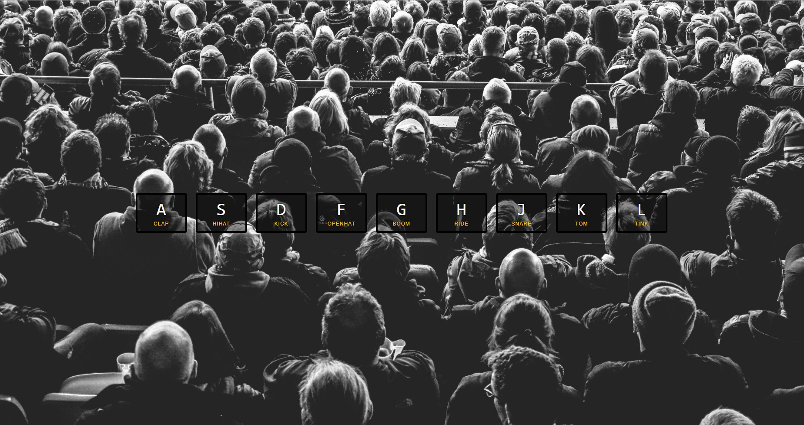
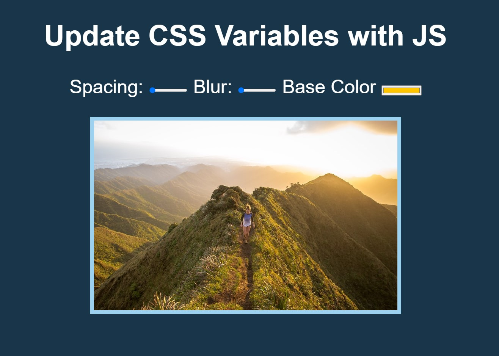
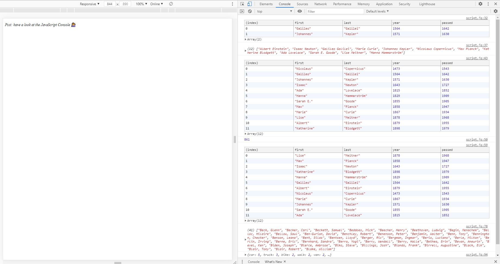
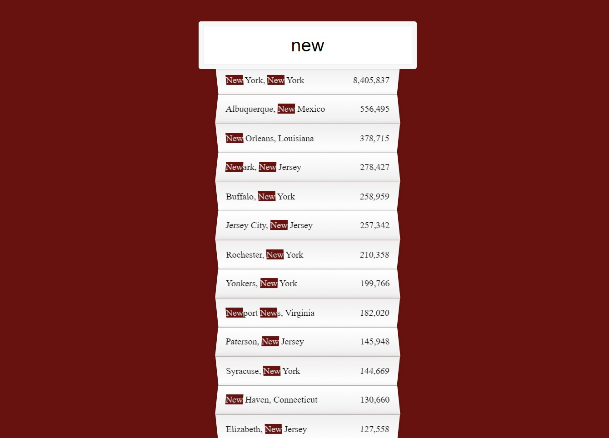

# 30 Day Vanilla JavaScript Coding Challenge  -with Wes Bos- 
Link: https://javascript30.com/

# Day 1: Drum Kit
When each letter on the screen is pressed from the keyboard, it runs the corresponding sound file.

# Day 2: Clock
Analog clock design with JavaScript.

# Day 3: CSS Variables With JS
Functions to change the size, blur and background color of the picture on the screen were provided with JavaScript.

# Day 4: Array Cardio Practice
JavaScript array exercises were done on the console.

# Day 5: Image Gallery
Clicking on each photo expands and completes the text from above and below.

# Day 6: Type Ahead
It aims to search through the information I get through an API.

# Day 7: Array Cardio-2

.some(), .every(), .find() and [...spreads]
